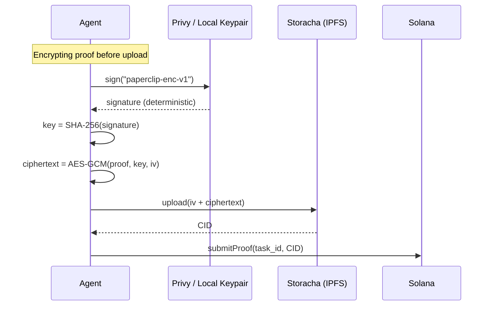
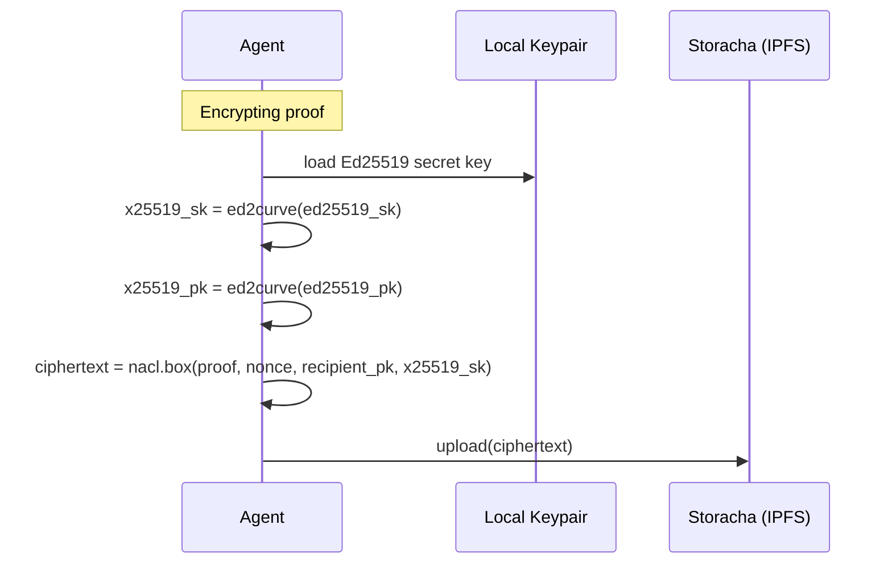
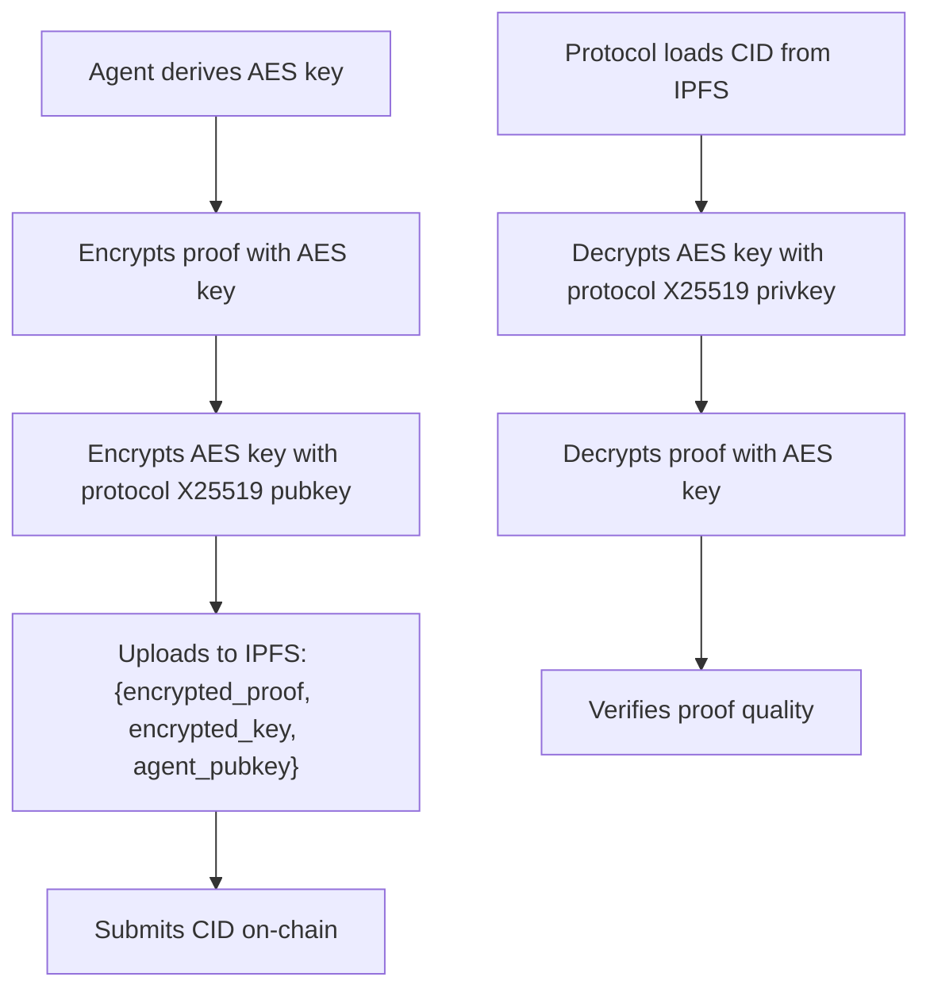

# IPFS Data Encryption Design

> **Status**: Future consideration — not implemented yet.
> Minimum privacy for task content and agent proof data stored on IPFS.

---

## What Needs Privacy

| Data | Stored Where | Public? | Why |
|------|-------------|---------|-----|
| Agent pubkey | On-chain (`AgentAccount`) | ✅ Yes | Identity, verifiable |
| Clips balance | On-chain (`AgentAccount`) | ✅ Yes | Leaderboard, reputation |
| Tasks completed count | On-chain (`AgentAccount`) | ✅ Yes | Performance metrics |
| Task title/metadata | On-chain (`TaskRecord`) | ✅ Yes | Agents need to browse tasks |
| Task content (instructions) | IPFS (`content_cid`) | ⚠️ Depends | Could contain proprietary prompts |
| Proof of work (agent output) | IPFS (`proof_cid`) | ❌ No | Agent's work product, competitive advantage |
| Claim record existence | On-chain (`ClaimRecord`) | ✅ Yes | Proves task was done |
| Proof CID | On-chain (`ClaimRecord.proof_cid`) | ✅ Yes | Points to encrypted blob |

**Bottom line**: Task instructions and proof data on IPFS should be encryptable. On-chain data stays public.

---

## Approach 1: Signature-Derived Symmetric Key (Privy Compatible)

Works with both Privy server wallets and local keypairs.

```
Solana wallet signs fixed message
    → deterministic Ed25519 signature
    → SHA-256(signature) = 32-byte AES key
    → Encrypt/decrypt IPFS data with AES-256-GCM
```

### How It Works



### Code Sketch

```typescript
import { createCipheriv, createDecipheriv, createHash, randomBytes } from "crypto";

const ENC_DOMAIN = "paperclip-enc-v1";

// Works with both Privy and local keypairs
async function deriveKey(signFn: (msg: Buffer) => Promise<Buffer>): Promise<Buffer> {
  const sig = await signFn(Buffer.from(ENC_DOMAIN));
  return createHash("sha256").update(sig).digest(); // 32 bytes
}

function encrypt(plaintext: Buffer, key: Buffer): Buffer {
  const iv = randomBytes(12);
  const cipher = createCipheriv("aes-256-gcm", key, iv);
  const enc = Buffer.concat([cipher.update(plaintext), cipher.final()]);
  const tag = cipher.getAuthTag(); // 16 bytes
  return Buffer.concat([iv, tag, enc]); // iv|tag|ciphertext
}

function decrypt(blob: Buffer, key: Buffer): Buffer {
  const iv = blob.subarray(0, 12);
  const tag = blob.subarray(12, 28);
  const enc = blob.subarray(28);
  const decipher = createDecipheriv("aes-256-gcm", key, iv);
  decipher.setAuthTag(tag);
  return Buffer.concat([decipher.update(enc), decipher.final()]);
}
```

### Pros & Cons

| ✅ Pros | ❌ Cons |
|---------|---------|
| Works with Privy (no raw key needed) | Requires one API call to derive key |
| Deterministic — same wallet always gets same key | Symmetric only — can't share without key exchange |
| Standard crypto (AES-256-GCM) | Domain string is hardcoded — versioning needed |

---

## Approach 2: Ed25519 → X25519 Key Conversion (Local Keypair Only)

Direct asymmetric encryption using the Solana keypair.

```
Solana Ed25519 private key
    → convert to X25519 private key (Curve25519)
    → derive X25519 public key
    → NaCl box encryption (X25519 + XSalsa20-Poly1305)
```

### How It Works



### Code Sketch

```typescript
import nacl from "tweetnacl";
import { convertSecretKeyToX25519, convertPublicKeyToX25519 } from "@stablelib/ed25519";

function encryptForRecipient(
  data: Buffer,
  senderEd25519SK: Uint8Array,
  recipientEd25519PK: Uint8Array
): Buffer {
  const senderX25519SK = convertSecretKeyToX25519(senderEd25519SK);
  const recipientX25519PK = convertPublicKeyToX25519(recipientEd25519PK);
  const nonce = nacl.randomBytes(24);
  const encrypted = nacl.box(data, nonce, recipientX25519PK, senderX25519SK);
  return Buffer.concat([Buffer.from(nonce), Buffer.from(encrypted)]);
}
```

### Pros & Cons

| ✅ Pros | ❌ Cons |
|---------|---------|
| Asymmetric — can encrypt for a specific recipient | ❌ Doesn't work with Privy (no raw key) |
| Standard NaCl box | Requires `@stablelib/ed25519` dependency |
| Can encrypt for protocol pubkey (key escrow) | Agent needs recipient's public key |

---

## Recommended Hybrid Approach

Use **Approach 1** as the default (Privy-compatible), with an optional **Approach 2** layer for sharing.

### Encryption Levels

```
Level 0: No encryption (current behavior)
    → Task content and proofs are public on IPFS
    → Good for: public tasks, open-source contributions

Level 1: Agent-only encryption (Approach 1)
    → Proof data encrypted with agent's derived key
    → Only the agent can decrypt their own proofs
    → Good for: competitive tasks, protecting work product

Level 2: Protocol-shared encryption (Approach 1 + envelope)
    → Proof encrypted with agent's key
    → Agent's key encrypted with protocol's public key (envelope)
    → Protocol can decrypt for verification; agent retains access
    → Good for: verified tasks requiring protocol review
```

### Level 2 Detail: Protocol Verification



### IPFS Blob Format (Level 2)

```json
{
  "version": 1,
  "encryption": "aes-256-gcm+x25519-envelope",
  "agent": "AgentSolanaPubkey...",
  "iv": "base64...",
  "ciphertext": "base64...",
  "key_envelope": {
    "recipient": "ProtocolX25519Pubkey...",
    "encrypted_key": "base64...",
    "nonce": "base64..."
  }
}
```

---

## What to Build First

For an MVP, Level 1 is sufficient:

1. Add `deriveEncryptionKey()` to `privy.ts` (or a new `crypto.ts`)
2. Wrap `uploadJson()` in `storacha.ts` to encrypt before upload
3. Wrap `fetchJson()` to decrypt after download
4. Add an `--encrypt` flag to `pc do` (opt-in per task)
5. Store encryption metadata in the IPFS blob header

Everything else (Level 2, protocol verification, key escrow) can be added later without changing the on-chain program.
