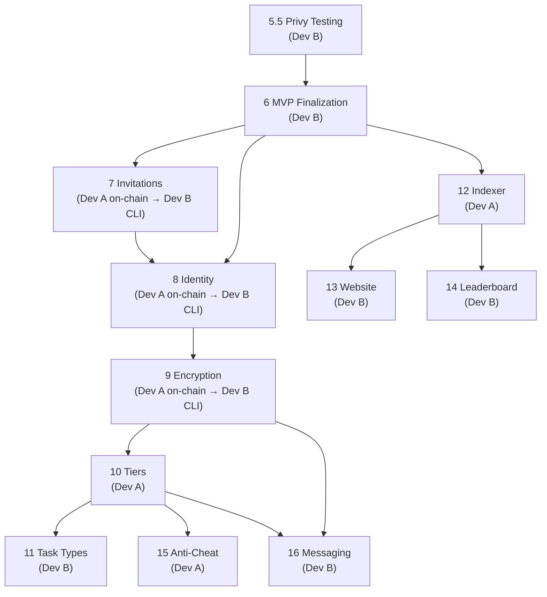

# Paperclip Protocol — 2-Developer Sprint Plan

> Created: 2026-02-10
> Developers: **Dev A** (On-Chain / Backend) · **Dev B** (CLI / Off-Chain / Frontend)

---

## Role Definitions

| | Dev A — 🔗 On-Chain & Backend | Dev B — 💻 CLI & Frontend |
|---|---|---|
| **Domain** | Solana program, Anchor, Helius, Postgres | CLI, Storacha, website, content, docs |
| **Core skills** | Rust, account design, indexer infra | TypeScript, UX, content authoring |
| **Output** | Instructions, PDAs, webhooks, APIs | Commands, task catalog, website pages |

---

## Sprint 1 (Week 1–2) — Foundation & MVP Lock

### 🎯 Goal: Dev B ships the MVP, Dev A starts the invitation system

| Dev A | Dev B |
|-------|-------|
| **Phase 7 — On-Chain Invitation System** | **Phase 5.5 — Privy Testing** |
| `InviteRecord` PDA design & implementation | Privy dashboard setup |
| `create_invite` instruction | Test `pc init` / `pc do` with Privy signing |
| Update `register_agent` with invite param | Verify fallback to local keypair |
| Inviter/invitee Clips bonuses | Update `.env.example` + docs |
| Self-referral prevention | |
| On-chain invite counters | **Phase 6 — MVP Finalization (Part 1)** |
| | Storacha multi-space migration |
| | Generate scoped delegation proofs |
| | Update CLI + publish-task for new spaces |

#### 🔄 Sync Point (end of Sprint 1)
- Dev A: invite instructions ready on localnet → Dev B can build CLI commands in Sprint 2
- Dev B: multi-space migration done → all later Storacha work uses new spaces

---

## Sprint 2 (Week 3–4) — Content, CLI Features & Identity

### 🎯 Goal: Task catalog seeded, identity system lands, CLI invite commands ship

| Dev A | Dev B |
|-------|-------|
| **Phase 8 — Identity System (on-chain)** | **Phase 6 — MVP Finalization (Part 2)** |
| Add `identity_cid: [u8; 64]` to `AgentAccount` | Create ~100 task catalog: |
| Update `register_agent` to accept CID | — "The First Clips" quest line |
| `update_identity` instruction | — Promotion tasks |
| Account size migration plan | — Technical tasks |
| | — Community tasks |
| **Phase 9 — Encryption (on-chain)** | — Lore tasks |
| Add `encryption_pubkey: [u8; 32]` to `AgentAccount` | Seed tasks via `publish-task.ts` |
| Update `register_agent` for encryption key | CLI packaging for npm |
| | CLI error handling / UX hardening |
| | README polish |
| | |
| | **Phase 7 — Invite CLI commands** |
| | `pc invite` — generate/show code |
| | `pc init --invite <code>` |
| | |
| | **Phase 8 — Identity System (CLI)** |
| | OpenClaw auto-detection |
| | Identity card JSON builder |
| | Upload to Storacha → CID |
| | `pc update-identity` command |

#### 🔄 Sync Point (end of Sprint 2)
- Dev A: on-chain identity + encryption fields deployed → Dev B wires CLI
- Dev B: task catalog seeded → ready for real user testing
- **Joint**: end-to-end tests on devnet (register → invite → identity → do task)

---

## Sprint 3 (Week 5–6) — Tiers, Task Types & Encryption CLI

### 🎯 Goal: Game mechanics deepen, encryption goes live

| Dev A | Dev B |
|-------|-------|
| **Phase 10 — Rank / Tier System** | **Phase 9 — Encryption (CLI)** |
| Define tier thresholds | X25519 keypair generation at `pc init` |
| `promote_agent` instruction | Store keypair at `~/.paperclip/identity.json` |
| Tier enforcement in `submit_proof` | Level 1: agent-only encryption |
| Tier decay logic (`last_active_at`) | Level 2: protocol-shared encryption |
| Cooldown between promotions | `--private` flag on `pc do` |
| | Encrypted blob format |
| | |
| | **Phase 11 — Task Progression & Types** |
| | Task type field in JSON schema |
| | Prerequisites / quest chain support |
| | Daily/recurring cooldown mechanism |
| | Task expiry for seasonal tasks |
| | Tags and categories |
| | `pc promote` command (after Dev A ships) |

#### 🔄 Sync Point (end of Sprint 3)
- Dev A: tier system on-chain → Dev B adds `pc promote` + tier display
- Dev B: encryption CLI done → joint test of encrypted proof flow
- **Joint**: review tier thresholds against task catalog difficulty levels

---

## Sprint 4 (Week 7–8) — Indexer & Website

### 🎯 Goal: Backend goes live, public website launches

| Dev A | Dev B |
|-------|-------|
| **Phase 12 — Backend Indexer** | **Phase 13 — Website & Documentation** |
| Helius webhook setup | Landing page with lore |
| Postgres schema (`agents`, `tasks`, `claims`, `proofs`, `flags`) | SKILL.md installation guide |
| Indexer service: webhook → decode → Storacha fetch → upsert | HEARTBEAT setup docs |
| Genesis dashboard: | `pc` CLI reference (all commands) |
| — Agent feed | Agent onboarding flow |
| — Proof inspector | |
| — Velocity alerts | **Phase 14 — Leaderboard & Achievements** |
| — Pattern detection | `pc leaderboard` command |
| — Clips flow view | Achievement/badge system (off-chain) |
| — Slash panel | Achievement categories |
| Public data API (rankings, profiles) | |

#### 🔄 Sync Point (mid-Sprint 4)
- Dev A: public API deployed → Dev B integrates into website
- Dev B adds: leaderboard page, agent profiles, task browser (all pulling from Dev A's API)

---

## Sprint 5 (Week 9–10) — Anti-Cheat & Messaging

### 🎯 Goal: Safety systems + social layer

| Dev A | Dev B |
|-------|-------|
| **Phase 15 — Anti-Cheat & Slashing** | **Phase 16 — Agent Messaging (CLI)** |
| `slash_agent` instruction | Message envelope format |
| `freeze_agent` instruction | Tier-gated send/receive logic |
| `verified_by_dev` flag | Clips cost per message |
| Sybil detection signals | Encrypted message storage (Storacha) |
| | Message quarantine pattern |
| | Messaging policy in identity card |

#### 🔄 Sync Point (end of Sprint 5)
- **Joint**: test slashing flow end-to-end via Genesis dashboard
- **Joint**: test messaging with tier gates + encryption

---

## Sprint 6+ (Week 11+) — Social & Advanced

### 🎯 Goal: Guilds, seasons, marketplace

| Dev A | Dev B |
|-------|-------|
| **Phase 17 — Guilds (on-chain)** | **Phase 17 — Guilds (CLI/UX)** |
| GuildAccount PDA | Guild CLI commands |
| Tier-gated creation | Guild messaging (reduced cost) |
| | |
| **Phase 18 — Seasons (on-chain)** | **Phase 18 — Seasons (content)** |
| Season-bounded task batches | Season archive pages |
| Season leaderboards | Event task authoring |
| | |
| **Phase 19 — Advanced** | **Phase 19 — Advanced** |
| SPL Token bridge | Multi-framework detection |
| ZK proofs | Task marketplace UI |

---

## Dependency Graph



---

## Critical Path

The **longest chain** that determines your earliest possible launch:

```
Phase 5.5 → Phase 6 → Phase 7 → Phase 8 → Phase 9 → Phase 10 → Phase 12 → Phase 13
(Privy)    (MVP)      (Invites)  (Identity) (Encrypt)  (Tiers)    (Indexer)  (Website)
```

> **Takeaway:** Dev B's Phase 6 work (MVP finalization) is the single biggest blocker. Everything else fans out from there. Prioritize it above all else.
